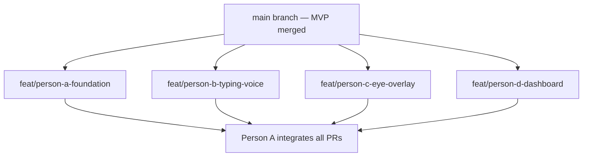
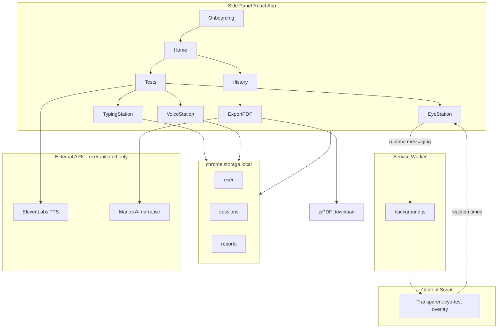

# Baseline Chrome Extension — Implementation Plan

## Starting point

**Setup PR merged on `main`** — PR #1 (`ce79ab4` Merge pull request #1 from feat/baseline-mvp).

```bash
git checkout main && git pull
npm install && npm run dev
# Load unpacked: .output/chrome-mv3
```

Everyone branches from `main` now. **Do not recreate the scaffold.**

---

## What is on `main` today (merged MVP)

| Area                                            | Status | File(s) on main                                        |
| ----------------------------------------------- | ------ | ------------------------------------------------------ |
| WXT + React 19 + TypeScript + Tailwind 4        | Done   | `wxt.config.ts`, `package.json`                        |
| Side panel on icon click                        | Done   | `entrypoints/background.ts`                            |
| 2-tab shell (Check-in \| History)               | Done   | `entrypoints/sidepanel/App.tsx`                        |
| Check-in orchestrator (Face → Voice → Reaction) | Done   | `entrypoints/sidepanel/CheckinFlow.tsx`                |
| Face station (MediaPipe camera)                 | Done   | `stations/FaceStation.tsx`                             |
| Voice station (RMS/duration)                    | Done   | `stations/VoiceStation.tsx`                            |
| Reaction station (WPM mini-game)                | Done   | `stations/ReactionStation.tsx`                         |
| Placeholder scoring (0–100)                     | Done   | `lib/analysis/placeholder.ts`, `lib/analysis/score.ts` |
| Storage (`DayRecord` keyed by date)             | Done   | `lib/storage.ts`                                       |
| Streak + totals                                 | Done   | `lib/stats.ts`                                         |
| Heatmap (13 weeks, score colours)               | Done   | `components/Heatmap.tsx`                               |
| JSON export                                     | Done   | `lib/export.ts`                                        |
| Demo seed + daily reminder                      | Done   | `lib/seed.ts`, `lib/reminder.ts`                       |
| MediaPipe bundled                               | Done   | `public/mediapipe/`, `lib/mediapipe.ts`                |

**Tech stack:** [WXT](https://wxt.dev) — `entrypoints/` + `lib/`, not `src/`.

---

## MVP → product spec (who changes what)

| MVP (on main)                                                         | Product spec target                            | Owner     | Action                                         |
| --------------------------------------------------------------------- | ---------------------------------------------- | --------- | ---------------------------------------------- |
| `CheckinFlow.tsx` + 3 stations                                        | `Tests.tsx` — Typing → Voice → Eye             | **A**     | Refactor orchestrator; swap station imports    |
| `ReactionStation.tsx` (WPM mini-game — **not** the final Typing test) | `TypingStation.tsx` — **Typing Dynamics Test** | **B**     | Replace entirely; no Tap Test                  |
| `VoiceStation.tsx` (RMS)                                              | `VoiceStation.tsx` (jitter/shimmer)            | **B**     | Rewrite in place                               |
| `FaceStation.tsx` (MediaPipe)                                         | `EyeStation.tsx` + content script              | **C**     | Replace; remove MediaPipe dependency later     |
| `lib/analysis/*` (0–100 scores)                                       | `lib/scoring.ts` (Stable/Monitor/Flag)         | **A**     | New scoring layer                              |
| `DayRecord` in `lib/storage.ts`                                       | `Session` + `User` + `Report`                  | **A**     | Schema migration                               |
| 2 tabs in `App.tsx`                                                   | Home / Tests / History                         | **A**     | Refactor nav; **D** fills Home + History views |
| `TodayCard` in Check-in tab                                           | `views/Home.tsx`                               | **D**     | Extract + expand                               |
| `HistoryTab` in App                                                   | `views/History.tsx`                            | **D**     | Extract + expand                               |
| `Heatmap.tsx` (13 weeks)                                              | `ActivityGrid.tsx` (full year)                 | **D**     | Upgrade                                        |
| —                                                                     | `Sparkline.tsx`                                | **D**     | New                                            |
| —                                                                     | `DriftAlert.tsx`                               | **D**     | New                                            |
| JSON export in `lib/export.ts`                                        | Manus + jsPDF PDF export                       | **D**     | Replace                                        |
| —                                                                     | `lib/elevenlabs.ts`                            | **B**     | New                                            |
| —                                                                     | `lib/typingMetrics.ts`                         | **B**     | New                                            |
| —                                                                     | `entrypoints/eyeOverlay.content.ts`            | **C**     | New (WXT naming)                               |
| `wxt.config.ts` permissions                                           | Add `scripting`, `activeTab`, host permissions | **A + C** | A merges manifest; C needs overlay             |

---

## Phase 0 — Setup PR (complete)

Merged. Verify locally:

- [x] PR #1 merged to `main`
- [ ] `npm install && npm run dev` — side panel opens
- [ ] Check-in flow completes (Face → Voice → Reaction)
- [ ] Heatmap renders after "Seed demo data"
- [ ] JSON export downloads

---

## Phase 0b — Team kickoff (now)



**Branch naming convention:**

- Person A → `feat/person-a-foundation`
- Person B → `feat/person-b-typing-voice`
- Person C → `feat/person-c-eye-overlay`
- Person D → `feat/person-d-dashboard`

**Merge order:** Person A's schema + nav PR should merge **first** (or early), so B/C/D can wire to real types. B, C, D can develop in parallel using mocks until then.

---

## Architecture



**Privacy model:** Session metrics never leave the device except when the family member explicitly clicks "Export for GP Appointment" (Manus receives aggregated scores/dates only). ElevenLabs receives instruction text only — no health data. Voice audio is processed in-memory and discarded.

---

## Phase 1 — Project scaffold

**Already in setup PR.** Person A extends rather than recreates.

**Tooling:** WXT + React 19 + TypeScript + Tailwind CSS 4 (via `@tailwindcss/vite`).

**Existing files (do not duplicate):**

| File                                                                 | Purpose                                                |
| -------------------------------------------------------------------- | ------------------------------------------------------ |
| [`package.json`](package.json)                                       | WXT scripts, React, MediaPipe                          |
| [`wxt.config.ts`](wxt.config.ts)                                     | MV3 manifest, sidePanel, storage, alarms               |
| [`entrypoints/sidepanel/App.tsx`](entrypoints/sidepanel/App.tsx)     | App shell — **A refactors to 3 tabs**                  |
| [`entrypoints/background.ts`](entrypoints/background.ts)             | Side panel + reminders — **C extends for eye test**    |
| [`lib/storage.ts`](lib/storage.ts)                                   | `DayRecord` storage — **A migrates to Session schema** |
| [`entrypoints/sidepanel/style.css`](entrypoints/sidepanel/style.css) | Tailwind entry                                         |

**Person A still adds after merge:**

- [`.env.example`](.env.example) — `VITE_ELEVENLABS_API_KEY`, `VITE_MANUS_API_KEY`
- [`lib/scoring.ts`](lib/scoring.ts) — Stable/Monitor/Flag + drift detection
- [`lib/types.ts`](lib/types.ts) — canonical `Session`, `User`, `Report` types
- Onboarding flow, 3-tab nav (Home / Tests / History)
- One-session-per-day guard

**Design tokens** (extend in `style.css` / Tailwind): minimum 18px body text, 48px+ touch targets, activity grid colours (`#166534`, `#86efac`, `#f59e0b`, `#e5e7eb`). Person D applies these on dashboard screens; Person A defines them globally.

---

## Phase 2 — Data layer and types

Create [`lib/types.ts`](lib/types.ts) and extend [`lib/storage.ts`](lib/storage.ts).

**Target schema** (Person A migrates from current `DayRecord`):

```typescript
interface User {
  firstName: string;
  installedAt: string;
}
interface Session {
  date: string; // YYYY-MM-DD, one per day max
  completed: boolean;
  typing: {
    rhythmVariance: number; // ms — primary metric
    avgFlightTime: number; // ms
    avgDwellTime: number; // ms
    totalTimeMs: number; // ms for full sentence
    errorCount: number; // backspaces used
  };
  voice: { jitter: number; shimmer: number };
  eye: { avgReactionMs: number; accuracy: number };
}
interface Report {
  generatedAt: string;
  type: "gp_export";
  content: string;
}
```

**Storage helpers:**

- `getUser()` / `setUser()`
- `getSessions()` / `saveSession(session)` — reject duplicate date
- `getTodaySession()` / `hasCompletedToday()`
- `getReports()` / `saveReport()`

**Current MVP schema** (in setup PR — temporary):

```typescript
// lib/storage.ts — DayRecord with baselineScore + stations.face|voice|reaction
```

**Migration note:** Person A maps `DayRecord` → `Session` or replaces storage key. Person D reads from whatever A lands; use mock `Session[]` until migration merges.

---

## Phase 3 — Scoring and drift detection

Create [`lib/scoring.ts`](lib/scoring.ts) — replaces [`lib/analysis/placeholder.ts`](lib/analysis/placeholder.ts) seam.

**Per-test scoring:**

| Test                        | Primary metric   | Stable | Monitor | Flag  |
| --------------------------- | ---------------- | ------ | ------- | ----- |
| Typing rhythm variance (ms) | `rhythmVariance` | < 20   | 20–35   | > 35  |
| Voice jitter (%)            | `jitter`         | < 1.0  | 1.0–2.0 | > 2.0 |
| Eye avgReactionMs           | `avgReactionMs`  | < 250  | 250–350 | > 350 |

**Typing personal baseline (sessions 1–3 vs 4+):**

- Sessions 1–3: score typing using **fixed thresholds** above
- After 3 completed sessions: calculate personal baseline averages for all typing metrics (`rhythmVariance`, `avgFlightTime`, `avgDwellTime`, `totalTimeMs`, `errorCount`)
- From session 4 onwards: **primary typing score** compares `rhythmVariance` to personal baseline using percentage deviation (consistent with drift detection): ≤20% = Stable, 20–40% = Monitor, >40% = Flag. Personal baseline takes priority over fixed thresholds once established.

**Session helpers:**

- `scoreSession(session, allSessions)` → `{ typing, voice, eye }` each as `'stable' | 'monitor' | 'flag'`
- `getOverallStatus(scores)` → `Stable | Monitor | Discuss with GP` (worst metric wins; Flag → Discuss, Monitor → Monitor)
- `getPersonalBaseline(sessions)` → rolling average per metric across all completed sessions
- `hasTypingBaseline(sessions)` → `sessions.length >= 3`
- `calculateStreak(sessions)` → consecutive calendar days with completed sessions ending today/yesterday
- `detectDrift(sessions)` → for each metric, compare rolling 5-session average to personal baseline; if `> 20%` deviation for **3+ consecutive sessions**, return drift alert payload `{ metric, direction, message }`

**Math utilities:**

- Typing: keydown/keyup timestamps via `performance.now()` → dwell times, flight times, inter-keystroke intervals → rhythm variance (variance of consecutive keydown intervals), error count (Backspace keydowns), total sentence time (first keydown → last keydown)
- Voice: autocorrelation pitch extraction per frame → jitter % and shimmer % (see Phase 5)
- Eye: mean reaction time + accuracy (% clicks within 60px of dot centre)

---

## Phase 4 — App shell, onboarding, navigation

**Partially done** in `App.tsx` (2-tab Check-in/History). Person A refactors to:

**Files:**

- [`entrypoints/sidepanel/App.tsx`](entrypoints/sidepanel/App.tsx) — 3 tabs: Home / Tests / History
- [`entrypoints/sidepanel/views/Onboarding.tsx`](entrypoints/sidepanel/views/Onboarding.tsx) — new
- [`entrypoints/sidepanel/components/BottomNav.tsx`](entrypoints/sidepanel/components/BottomNav.tsx) — new (or extend existing tab bar)

Person D owns **layout inside Home and History tabs** once shell exposes `{ tab, setTab }` or separate view components.

---

## Phase 5 — The three tests

**Test sequence (no Tap Test):** **Typing → Voice → Eye**

There is no Tap Test in this product. The first test is the **Typing Dynamics Test** (motor & cognitive baseline). On the merged MVP, Person B replaces `ReactionStation.tsx` — not a tap button test.

Orchestrated by Person A in [`entrypoints/sidepanel/views/Tests.tsx`](entrypoints/sidepanel/views/Tests.tsx) (replaces/evolves `CheckinFlow.tsx`):

- Progress bar (1 of 3, 2 of 3, 3 of 3)
- Block if `hasCompletedToday()` — show "Done for today" with link to History
- Sequence per test: Instructions → Active test → Results → next test → Session summary

---

### Test 1 — Typing Dynamics (Motor & Cognitive Baseline)

**Owner:** Person B  
**File:** [`entrypoints/sidepanel/stations/TypingStation.tsx`](entrypoints/sidepanel/stations/TypingStation.tsx)  
**Replaces:** `ReactionStation.tsx` on main (WPM mini-game) — remove entirely, do not keep any tap-based test

The user types a fixed sentence every day. We measure **how** they type it — not what they type. Same sentence every session so any change in typing pattern is genuine drift, not unfamiliarity.

#### Fixed sentence (never changes)

```
today i feel well and my mind is clear
```

#### UI

- Display the sentence clearly above an empty input box
- Input is plain text — no autocorrect, autocomplete, or spellcheck:
  ```tsx
  spellCheck={false} autoComplete="off" autoCorrect="off"
  ```
- User types the sentence exactly as shown
- **Do not start the timer until the first keypress**
- Show a subtle live character match indicator so the user knows they are typing correctly
- When the full sentence is typed correctly, the test **ends automatically**
- If the user makes errors (backspaces), record them but **do not stop** the test

#### What to record

Use `keydown` and `keyup` events. Record `performance.now()` for **every** keydown and keyup.

From those timestamps, calculate in [`lib/typingMetrics.ts`](lib/typingMetrics.ts):

| #   | Metric                  | Calculation                                                                                          |
| --- | ----------------------- | ---------------------------------------------------------------------------------------------------- |
| 1   | **Dwell time**          | `keyup − keydown` per key; average across all keys (ms)                                              |
| 2   | **Flight time**         | `next keydown − previous keyup`; average and variance across transitions (ms)                        |
| 3   | **Total sentence time** | First keydown → last keydown (ms)                                                                    |
| 4   | **Error count**         | Total Backspace keydowns                                                                             |
| 5   | **Rhythm variance**     | Variance of inter-keystroke intervals (consecutive keydown timestamps) — **primary drift indicator** |

#### Scoring (primary metric: rhythm variance)

| Status          | Threshold        |
| --------------- | ---------------- |
| Stable (green)  | variance < 20ms  |
| Monitor (amber) | variance 20–35ms |
| Flag (red)      | variance > 35ms  |

**Secondary metrics** (shown in `ResultCard`, not used for primary score):

- Total time vs personal baseline average
- Error count vs personal baseline average
- Average dwell time vs personal baseline average

#### Personal baseline (typing only)

- **Sessions 1–3:** score using fixed thresholds above
- **After session 3:** calculate personal baseline averages for all typing metrics
- **From session 4 onwards:** compare `rhythmVariance` to personal baseline (≤20% = Stable, 20–40% = Monitor, >40% = Flag). Personal baseline **takes priority** over fixed thresholds once established.

#### Data stored per session

```typescript
typing: {
  rhythmVariance: 18.4,   // ms — primary metric
  avgFlightTime: 112.3,   // ms
  avgDwellTime: 68.2,     // ms
  totalTimeMs: 4240,      // ms for full sentence
  errorCount: 1           // backspaces used
}
```

#### ElevenLabs instruction (spoken before test starts)

> "Please type the sentence you see on screen exactly as shown. Type at your natural pace — there is no need to rush."

#### Results screen

[`entrypoints/sidepanel/components/ResultCard.tsx`](entrypoints/sidepanel/components/ResultCard.tsx):

- Primary: rhythm variance + Stable/Monitor/Flag badge
- Secondary vs personal baseline (when available): total time, error count, average dwell time
- Static reassuring copy (no AI)

---

### Shared: instruction audio

Create [`lib/elevenlabs.ts`](lib/elevenlabs.ts):

- `speakInstructions(text: string)` — POST to ElevenLabs TTS API, play returned audio via `Audio` element
- Graceful degradation: if API key missing or call fails, show text-only instructions with a "Read aloud unavailable" note — never block the test

Called at the start of each test's instruction screen (typing script quoted above).

### Test 2 — Voice test — [`entrypoints/sidepanel/stations/VoiceStation.tsx`](entrypoints/sidepanel/stations/VoiceStation.tsx)

(Replaces current RMS-based voice station)

- Request mic via `navigator.mediaDevices.getUserMedia({ audio: true })`
- `AudioContext` + `AnalyserNode` + `ScriptProcessorNode` (or `AudioWorklet` if supported)
- 5-second sustained vowel capture; autocorrelation pitch per 30ms frame
- Compute jitter (% period-to-period variation) and shimmer (% amplitude variation)
- **Stop all tracks and close AudioContext immediately after** — no audio persisted
- Results: jitter primary score, shimmer shown as secondary detail

### Test 3 — Eye test — [`entrypoints/sidepanel/stations/EyeStation.tsx`](entrypoints/sidepanel/stations/EyeStation.tsx) + [`entrypoints/eyeOverlay.content.ts`](entrypoints/eyeOverlay.content.ts)

(Replaces `FaceStation.tsx` + MediaPipe in-panel approach)

**Why content script:** The dot must appear at random positions on the **full browser viewport**, not inside the narrow side panel.

**Message protocol** (via background):

```
Side panel → { type: 'EYE_TEST_START' }
Content script → creates fixed overlay (position: fixed, inset: 0, z-index: 2147483647, background: transparent, pointer-events: auto)
Content script → 10 rounds: show 40px dot at random (x,y), record appear time, on click record reaction time
Content script → { type: 'EYE_TEST_COMPLETE', results: [{ reactionMs, hit: boolean }] }
Content script → removes overlay DOM entirely
```

**Overlay safety constraints:**

- `pointer-events: auto` only on overlay layer; remove on completion/error
- No modification of underlying page DOM except injected overlay root
- Timeout per dot (2s) → count as miss, continue
- Side panel shows "Look at the page behind this panel" instruction

---

## Phase 6 — Home view

Create [`entrypoints/sidepanel/views/Home.tsx`](entrypoints/sidepanel/views/Home.tsx) and [`entrypoints/sidepanel/components/DriftAlert.tsx`](entrypoints/sidepanel/components/DriftAlert.tsx).

**Person D owns layout and visual design of this view.**

**Displays:**

- Greeting: "Good morning, {firstName}"
- Today status: complete checkmark or "Run today's tests →" CTA
- Streak counter + total sessions
- Overall baseline status badge (from latest session + drift state)
- [`DriftAlert`](entrypoints/sidepanel/components/DriftAlert.tsx) when `detectDrift()` returns active drift
- Last session quick summary (typing rhythm variance, voice jitter, eye reaction time)

---

## Phase 7 — History view and activity grid

**Files (Person D):**

- [`entrypoints/sidepanel/views/History.tsx`](entrypoints/sidepanel/views/History.tsx) — extract from `App.tsx` HistoryTab
- [`entrypoints/sidepanel/components/ActivityGrid.tsx`](entrypoints/sidepanel/components/ActivityGrid.tsx) — upgrade from `Heatmap.tsx`
- [`entrypoints/sidepanel/components/Sparkline.tsx`](entrypoints/sidepanel/components/Sparkline.tsx) — new

**Reuse from setup PR:** `lib/stats.ts` (`currentStreak`, `totalCheckins`) — extend as needed after schema migration.

### Activity grid

GitHub-style calendar: 52 weeks × 7 days for current year.

**Per-day color logic:**

- Grey — no session
- Dark green (`#166534`) — completed, all metrics Stable
- Light green (`#86efac`) — completed, any metric Monitor (none Flag)
- Amber (`#f59e0b`) — completed, any metric Flag OR day falls within active drift period

**Interactions:** Hover tooltip with date + typing/voice/eye scores + status labels. Highlight today's square with border.

**Header stats:** streak + total sessions (reuse `scoring.ts` helpers).

### Sparklines

Three SVG sparklines below grid: typing rhythm variance, voice jitter, eye reaction time over all sessions. Reuse [`Sparkline.tsx`](entrypoints/sidepanel/components/Sparkline.tsx) in PDF export too.

---

## Phase 8 — GP export (Manus + jsPDF)

**Files (Person D):**

- [`lib/manus.ts`](lib/manus.ts) — narrative generation
- [`lib/export.ts`](lib/export.ts) — **extend/replace** current JSON export with jsPDF
- [`lib/exportTemplate.ts`](lib/exportTemplate.ts) — fallback when Manus fails
- [`entrypoints/sidepanel/components/ReportViewer.tsx`](entrypoints/sidepanel/components/ReportViewer.tsx) — optional preview

### Manus integration

`generateGPNarrative(sessions, firstName)` sends structured prompt with all scores/dates, session count, date range. Expect plain-text response with 6 sections:

1. Monitoring Summary
2. Motor & Cognitive Assessment (typing dynamics trend)
3. Speech Assessment
4. Visual Reaction Assessment
5. Overall Status
6. Note for Clinician

Manus prompt includes typing metrics per session: `rhythmVariance`, `avgFlightTime`, `avgDwellTime`, `totalTimeMs`, `errorCount`.

**API approach:** Use Manus task/completions API with `VITE_MANUS_API_KEY` from build env. Wrap in try/catch with 30s timeout.

### Fallback template

If Manus fails, generate narrative from [`lib/exportTemplate.ts`](lib/exportTemplate.ts) — insert scores, trends, and overall status. Footer note: "AI narrative unavailable — summary data only."

### jsPDF output

[`lib/export.ts`](lib/export.ts):

- Page 1: Baseline header, patient name, date range, Manus/template narrative
- Page 2: 3 sparkline charts (typing rhythm variance, voice jitter, eye reaction time)
- Footer every page: `Generated by Baseline | Not a diagnostic tool`
- Trigger `doc.save('baseline-gp-report-{date}.pdf')`
- Save narrative text to `reports[]` in storage
- UX: button → "Preparing your report..." loading state → auto-download → success toast

---

## Phase 9 — Polish and elderly UX

- **Typography:** 18px minimum body, 24px+ headings, generous line-height (1.6)
- **Touch targets:** 48px minimum on all interactive elements
- **Color:** WCAG AA contrast; never use red alone for alarm — amber + calm language
- **Copy audit:** Every user-facing string reviewed for non-diagnostic, non-alarmist tone
- **Error states:** Mic denied → explain how to re-enable; eye overlay fails → retry button
- **README:** Load unpacked extension instructions, `.env` setup, daily test walkthrough

---

## Suggested file tree (after full spec)

```
baseline/
├── wxt.config.ts
├── package.json
├── .env.example
├── entrypoints/
│   ├── background.ts              # side panel + reminders (+ eye relay)
│   ├── content/
│   │   └── eyeOverlay.content.ts  # Person C — WXT content script
│   └── sidepanel/
│       ├── App.tsx                # Person A — 3-tab shell
│       ├── main.tsx
│       ├── index.html
│       ├── style.css
│       ├── views/
│       │   ├── Onboarding.tsx     # Person A
│       │   ├── Home.tsx           # Person D
│       │   ├── Tests.tsx          # Person A (was CheckinFlow)
│       │   └── History.tsx        # Person D
│       ├── stations/
│       │   ├── TypingStation.tsx  # Person B (was ReactionStation)
│       │   ├── VoiceStation.tsx   # Person B
│       │   └── EyeStation.tsx     # Person C (was FaceStation)
│       └── components/
│           ├── BottomNav.tsx
│           ├── ActivityGrid.tsx   # Person D (evolve Heatmap.tsx)
│           ├── Sparkline.tsx      # Person D
│           ├── DriftAlert.tsx     # Person D
│           ├── ResultCard.tsx     # Person B
│           ├── ReportViewer.tsx   # Person D
│           └── Heatmap.tsx        # deprecated → ActivityGrid
├── lib/
│   ├── types.ts                   # Person A
│   ├── storage.ts                 # Person A migrates schema
│   ├── scoring.ts                 # Person A
│   ├── typingMetrics.ts           # Person B
│   ├── stats.ts                   # exists — extend
│   ├── elevenlabs.ts              # Person B
│   ├── manus.ts                   # Person D
│   ├── export.ts                  # Person D (jsPDF replaces JSON)
│   ├── exportTemplate.ts          # Person D
│   ├── seed.ts                    # update for new Session shape
│   └── reminder.ts
└── README.md
```

---

## Team work split — 4 people (all guides)

Setup PR is merged. Each person has a **step-by-step build guide** below.

### Shared contract (Person A lands first)

Person A's PR should merge before others wire to production storage:

- [`lib/types.ts`](lib/types.ts) — `User`, `Session`, `Report`
- Updated [`lib/storage.ts`](lib/storage.ts) — `getUser`, `getSessions`, `saveSession`, `hasCompletedToday`
- [`lib/scoring.ts`](lib/scoring.ts) — `scoreSession`, `detectDrift`, `calculateStreak`
- 3-tab `App.tsx` with slots: `<Home />`, `<Tests />`, `<History />`

**Until A merges:** B/C/D use mock data and stub `onComplete` callbacks. Coordinate in Slack/issues before editing the same files (`App.tsx`, `CheckinFlow.tsx`, `wxt.config.ts`).

**Test component contract:**

```typescript
<TypingStation onComplete={(typing) => void} onError={() => void} />
<VoiceStation onComplete={(voice) => void} onError={() => void} />
<EyeStation onComplete={(eye) => void} onError={() => void} />
```

---

## Person A — Step-by-step build guide

**Role:** Foundation + integration lead. Owns schema, scoring, nav, test orchestrator.

**Start from:** `CheckinFlow.tsx`, `lib/storage.ts`, `lib/analysis/*`, `App.tsx`

### Step 1 — Branch + types

```bash
git checkout main && git pull
git checkout -b feat/person-a-foundation
```

1. Create [`lib/types.ts`](lib/types.ts) with `User`, `Session`, `Report` (see Phase 2 schema)
2. Migrate [`lib/storage.ts`](lib/storage.ts):
   - Add `baseline:user`, `baseline:sessions`, `baseline:reports` keys (or migrate from `baseline:records`)
   - Implement `getUser`, `setUser`, `getSessions`, `saveSession`, `hasCompletedToday`
   - Keep `dateKey()` and `onRecordsChanged` pattern (rename to `onSessionsChanged`)
3. Open PR early so B/C/D can review types

### Step 2 — Scoring + drift

1. Create [`lib/scoring.ts`](lib/scoring.ts) — replaces `lib/analysis/placeholder.ts` for final scores
2. Implement thresholds (typing rhythm variance, voice jitter, eye reaction time)
3. Implement typing personal baseline (sessions 1–3 fixed, session 4+ vs baseline)
4. Implement `detectDrift()` — 20% deviation for 3+ consecutive sessions
5. Extend [`lib/stats.ts`](lib/stats.ts) to work with `Session[]` instead of `RecordMap`

### Step 3 — Nav + onboarding + orchestrator

1. Refactor [`App.tsx`](entrypoints/sidepanel/App.tsx): 3 tabs — **Home | Tests | History**
2. Create [`entrypoints/sidepanel/views/Onboarding.tsx`](entrypoints/sidepanel/views/Onboarding.tsx) — welcome, firstName, start tests
3. Evolve [`CheckinFlow.tsx`](entrypoints/sidepanel/CheckinFlow.tsx) → [`views/Tests.tsx`](entrypoints/sidepanel/views/Tests.tsx):
   - Change `STEPS` to `{ key: 'typing' }, { key: 'voice' }, { key: 'eye' }` — **Typing → Voice → Eye, no tap**
   - Import `TypingStation`, `VoiceStation`, `EyeStation` (stub until B/C merge)
   - Save `Session` shape on complete
   - **Block if `hasCompletedToday()`** — show "Done for today"
4. Update [`wxt.config.ts`](wxt.config.ts): add `scripting`, `activeTab`; host permissions for eye overlay (coordinate with C)
5. Add [`.env.example`](.env.example), update [`README.md`](README.md)
6. Update [`lib/seed.ts`](lib/seed.ts) for new `Session` shape

### Step 4 — Integration (after B/C/D PRs)

- Merge B's stations into `Tests.tsx`
- Merge C's `EyeStation` + content script
- Wire D's `Home.tsx` and `History.tsx` into `App.tsx` tabs
- Remove deprecated: `FaceStation`, `ReactionStation`, `lib/analysis/placeholder.ts`, MediaPipe (optional cleanup PR)

### Person A PR checklist

- [ ] `Session` saves correctly; one session per day enforced
- [ ] `scoreSession()` returns Stable/Monitor/Flag for all 3 metrics
- [ ] 3-tab nav works; onboarding stores firstName
- [ ] `Tests.tsx` runs Typing → Voice → Eye (with B/C components)
- [ ] `.env.example` documents API keys

---

## Person B — Step-by-step build guide

**Role:** Typing Dynamics (Test 1) + Voice (Test 2) + ElevenLabs + ResultCard. **No Tap Test.**

**Start from:** `ReactionStation.tsx` (delete — replace with TypingStation), `VoiceStation.tsx`, `CheckinFlow.tsx` STEPS

### Step 1 — Branch + typing metrics

```bash
git checkout main && git pull
git checkout -b feat/person-b-typing-voice
```

1. Create [`lib/typingMetrics.ts`](lib/typingMetrics.ts) — pure functions:
   - `computeTypingMetrics(keyEvents)` → `{ rhythmVariance, avgFlightTime, avgDwellTime, totalTimeMs, errorCount }`
   - Fixed sentence: `"today i feel well and my mind is clear"`
2. Create [`stations/TypingStation.tsx`](entrypoints/sidepanel/stations/TypingStation.tsx) (replace `ReactionStation.tsx`):
   - Sentence display + input (`spellCheck={false}`, `autoComplete="off"`)
   - keydown/keyup + `performance.now()`
   - Character match indicator; auto-complete on correct sentence
   - Call `onComplete(typingMetrics)`
3. Delete or deprecate `ReactionStation.tsx`

### Step 2 — Voice + ElevenLabs + ResultCard

1. Rewrite [`VoiceStation.tsx`](entrypoints/sidepanel/stations/VoiceStation.tsx):
   - 5s "Ahhhh" capture; autocorrelation pitch → jitter % + shimmer %
   - Discard audio stream immediately after
   - Call `onComplete({ jitter, shimmer })`
2. Create [`lib/elevenlabs.ts`](lib/elevenlabs.ts):
   - `speakInstructions(text)` with `VITE_ELEVENLABS_API_KEY`
   - Text-only fallback if key missing
3. Create [`components/ResultCard.tsx`](entrypoints/sidepanel/components/ResultCard.tsx):
   - Primary metric + Stable/Monitor/Flag badge
   - Static reassuring copy (no AI)
4. Add ElevenLabs scripts per test (typing: "Type at your natural pace…")

### Step 3 — Wire to orchestrator

- Update local `CheckinFlow.tsx` or `Tests.tsx` fork to import `TypingStation` + new `VoiceStation`
- Pass `speakInstructions()` on instruction screen before each test
- Coordinate with A on `STEPS` keys: `typing | voice | eye`

### Person B PR checklist

- [ ] Typing test records all 5 metrics; ends on correct sentence
- [ ] Voice test returns jitter/shimmer; no audio in storage
- [ ] ElevenLabs speaks or degrades gracefully
- [ ] ResultCard shows after each test
- [ ] Works standalone before A's schema PR (mock `onComplete`)

---

## Person C — Step-by-step build guide

**Role:** Eye test via full-page content script overlay (replaces MediaPipe Face station).

**Start from:** `FaceStation.tsx`, `entrypoints/background.ts`, `wxt.config.ts`

### Step 1 — Branch + content script

```bash
git checkout main && git pull
git checkout -b feat/person-c-eye-overlay
```

1. Create [`entrypoints/eyeOverlay.content.ts`](entrypoints/eyeOverlay.content.ts) (WXT convention):
   ```typescript
   export default defineContentScript({
     registration: "runtime",
     matches: ["<all_urls>"],
     main(ctx) {
       /* listen for messages, run 10 dot trials, reply with results */
     },
   });
   ```
2. Overlay: `position: fixed; inset: 0; z-index: 2147483647; background: transparent`
3. 10 rounds: 40px dot at random (x,y); record reaction ms; 2s timeout → miss
4. On complete: remove overlay DOM entirely; post message to background

### Step 2 — Background relay

Extend [`entrypoints/background.ts`](entrypoints/background.ts):

- Listen for `{ type: 'EYE_TEST_START' }` from side panel
- `chrome.scripting.executeScript` or `chrome.tabs.sendMessage` to inject/run overlay on active tab
- Relay `{ type: 'EYE_TEST_COMPLETE', results }` back to side panel

### Step 3 — EyeStation side panel UI

1. Create [`stations/EyeStation.tsx`](entrypoints/sidepanel/stations/EyeStation.tsx) (replace `FaceStation.tsx`):
   - Instructions: "Look at the page behind this panel"
   - Send start message to background; await results
   - Compute `{ avgReactionMs, accuracy }` from 10 trials
   - Call `onComplete(eye)`
2. Request manifest permissions in PR (or coordinate with A): `scripting`, `activeTab`, host permissions

### Step 4 — Cleanup

- Remove `FaceStation.tsx`, `lib/mediapipe.ts`, `public/mediapipe/` (separate cleanup PR or with A's integration)

### Person C PR checklist

- [ ] Overlay appears on active tab, not inside side panel
- [ ] 10 dots complete; overlay removed; page usable after
- [ ] Returns avgReactionMs + accuracy
- [ ] Error state if injection fails (CSP / no active tab)
- [ ] No camera permission needed (MediaPipe removed)

---

## Person D — Step-by-step build guide

**Role:** Dashboard UI owner — Home + History layout, ActivityGrid, Sparklines, GP PDF export.

**Start from:** `App.tsx` (`HistoryTab`, `TodayCard`, `DataCard`), `Heatmap.tsx`, `lib/export.ts`, `lib/stats.ts`

### Step 1 — Branch + mocks

```bash
git checkout main && git pull
git checkout -b feat/person-d-dashboard
```

1. Create [`lib/mockSessions.ts`](lib/mockSessions.ts) — 10–20 fake `Session` objects (use target schema from Phase 2)
2. Build UI against mocks until A's storage PR merges

### Step 2 — ActivityGrid

Upgrade [`Heatmap.tsx`](entrypoints/sidepanel/components/Heatmap.tsx) → [`ActivityGrid.tsx`](entrypoints/sidepanel/components/ActivityGrid.tsx):

- Full calendar year (52×7), not 13 weeks
- Colours: dark green (all Stable), light green (Monitor), amber (Flag/drift), grey (no session)
- Tooltip: date + typing/voice/eye scores
- Reuse streak header from `lib/stats.ts`

### Step 3 — Home + DriftAlert

Create [`views/Home.tsx`](entrypoints/sidepanel/views/Home.tsx) + [`components/DriftAlert.tsx`](entrypoints/sidepanel/components/DriftAlert.tsx):

- Extract/evolve `TodayCard` from `App.tsx`
- Greeting, today status, streak, overall status badge, last session summary
- Drift alert (mock `detectDrift` until A merges scoring)
- **You own button placement and card layout on this screen**

### Step 4 — History view

Create [`views/History.tsx`](entrypoints/sidepanel/views/History.tsx):

- Extract/evolve `HistoryTab` from `App.tsx`
- Layout: stats row → ActivityGrid → 3 Sparklines → "Export for GP Appointment" CTA

Create [`components/Sparkline.tsx`](entrypoints/sidepanel/components/Sparkline.tsx) — reusable SVG trend line

### Step 5 — GP export

1. Add `jspdf` to `package.json`
2. [`lib/manus.ts`](lib/manus.ts) — `generateGPNarrative(sessions, firstName)`
3. [`lib/exportTemplate.ts`](lib/exportTemplate.ts) — fallback narrative
4. Replace JSON in [`lib/export.ts`](lib/export.ts) with jsPDF download
5. Loading UX: "Preparing your report..." → auto-download → toast

### Step 6 — Integration

When A merges: swap mocks for `getSessions()`; wire `DriftAlert` to `detectDrift()`; wire into Home/History tabs in `App.tsx`

### Person D PR checklist

- [ ] Home + History layout: 18px+ text, 48px touch targets
- [ ] ActivityGrid full year with spec colour coding
- [ ] Sparklines for 3 metrics
- [ ] PDF downloads; Manus fallback works without API key
- [ ] Does not break MVP check-in until A integrates 3-tab nav

---

### Integration checklist (whole team)

| When  | Who      | What                                    |
| ----- | -------- | --------------------------------------- |
| Done  | Teammate | Setup PR merged to `main`               |
| Day 1 | A        | Open PR: types + storage + scoring      |
| Day 1 | B, C, D  | Branch from `main`; build in parallel   |
| Day 2 | A        | Merge nav + Tests.tsx refactor          |
| Day 2 | B, C     | Merge station PRs                       |
| Day 2 | D        | Merge dashboard + PDF PR(s)             |
| Day 3 | A        | Final integration; remove MVP leftovers |
| Day 3 | All      | End-to-end test + copy audit            |

### Verification split

| Person | Owns verification of                                                    |
| ------ | ----------------------------------------------------------------------- |
| A      | Schema migration; one-session-per-day; 3-tab nav; full flow integration |
| B      | Typing metrics; voice jitter/shimmer; ElevenLabs fallback               |
| C      | Eye overlay inject/remove; 10 trials; no broken page                    |
| D      | Activity grid colours; Home/History layout; PDF + Manus fallback        |

---

## Build order (dependency-aware)

0. ~~Setup PR merge~~ **Done** (PR #1 on `main`)
1. **Person A** — types + storage + scoring PR (merge first)
2. **Parallel:** Person B (Typing + Voice), Person C (Eye overlay), Person D (dashboard + PDF with mocks)
3. **Person A** — 3-tab nav + Tests.tsx + onboarding PR
4. Merge B, C, D PRs
5. **Person A** — final integration; remove FaceStation, ReactionStation, MediaPipe
6. Whole team — end-to-end test, copy audit, README

---

## Key risks and mitigations

| Risk                                      | Mitigation                                                                                                                      |
| ----------------------------------------- | ------------------------------------------------------------------------------------------------------------------------------- |
| Voice pitch analysis accuracy in browser  | Use established autocorrelation algorithm; accept approximate jitter values suitable for trend tracking, not clinical precision |
| Eye overlay blocked on some sites (CSP)   | Content script injection via `scripting` API on active tab; show clear error if injection fails                                 |
| Manus API latency (5–15s)                 | Loading state + fallback template; never block PDF                                                                              |
| Side panel too narrow for typing          | Full-width input; large sentence display; character match indicator for confidence                                              |
| Typing baseline cold-start (sessions 1–3) | Fixed thresholds until 3 sessions establish personal baseline; show "building your baseline" copy                               |
| ElevenLabs costs / key missing            | Text-only fallback; instructions remain visible                                                                                 |
| `<all_urls>` permission review            | Required for eye overlay on any page; document in README why                                                                    |

---

## Verification checklist

- [ ] Extension loads unpacked in Chrome; side panel opens on icon click
- [ ] Onboarding stores first name; persists across reload
- [ ] Typing test records dwell/flight/rhythm metrics; ends on correct sentence completion
- [ ] Typing scores use fixed thresholds for sessions 1–3, personal baseline from session 4+
- [ ] Full test session completes in ~3 minutes (Typing → Voice → Eye); blocked on second attempt same day
- [ ] Activity grid colors match session scores; tooltip shows details
- [ ] Drift alert appears after 3+ consecutive 20% deviations
- [ ] ElevenLabs reads instructions (or degrades gracefully)
- [ ] PDF downloads with Manus narrative; fallback works with API key removed
- [ ] No audio files in storage; inspect `chrome.storage.local` confirms schema
- [ ] Eye overlay removes cleanly; underlying page remains interactive after test
